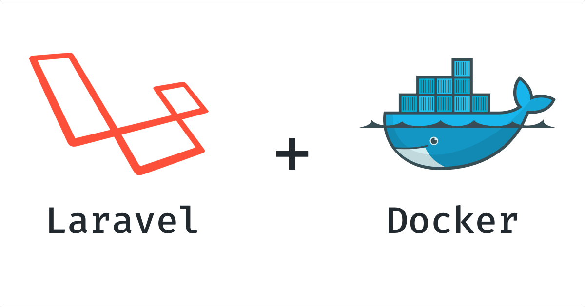
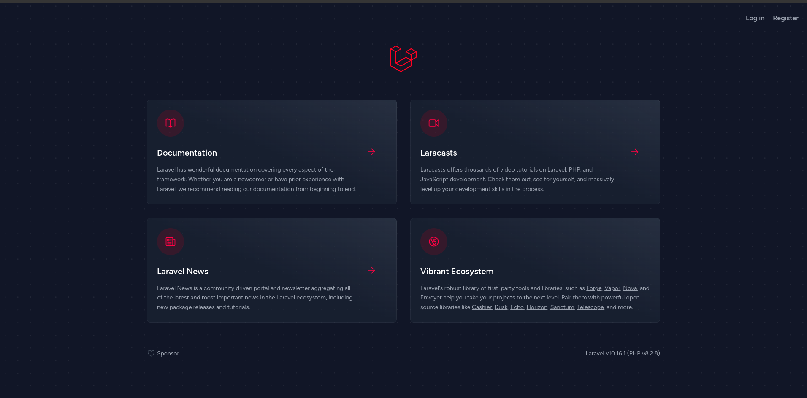
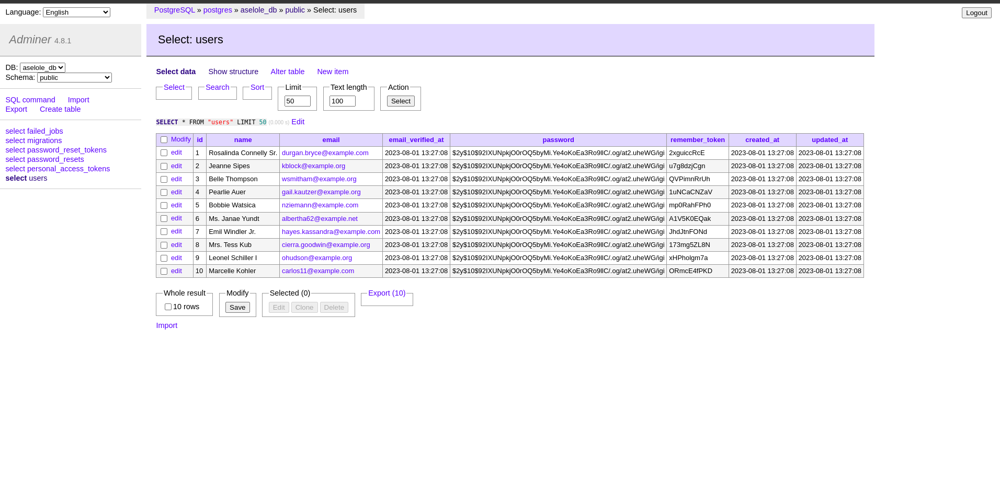
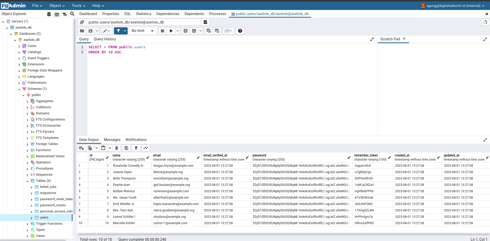

# Laravel using PostgreSQL in Docker

<p align="center">
    
</p>

## Introduction

Build a simple laravel application development environment with docker compose.


## Requirement

- Docker ^19.*


## Installation

1. Git clone & move to working directory
2. Settings your credentials, copy `.env.example` to `.env`
3. Execute the following command for create application

```bash
$ make create-project
```

4. Next, set environment DB for app laravel in  `src/.env` variable :
```
DB_CONNECTION=pgsql
DB_HOST=postgres
DB_PORT=5432
DB_DATABASE=<your_db_name>      // same in root .env variable POSTGRES_DB
DB_USERNAME=<your_db_user>      // same in root .env variable POSTGRES_USER
DB_PASSWORD=<your_db_password>  // same in root .env variable POSTGRES_PASSWORD
```

5. show application in [http://localhost:85](http://localhost:85)



1. show adminer in [http://localhost:8080](http://localhost:8080)



7. show pgadmin in [http://localhost:5050](http://localhost:5050)



8. list execute command in [Makefile](Makefile).

## Container details :
- ``app`` use image:
  - [php](https://hub.docker.com/_/php):8.2-fpm
  - [composer](https://hub.docker.com/_/composer):2.3
  - [npm](https://deb.nodesource.com/setup_lts.x):latest
- ``web`` use image:
  - [nginx](https://hub.docker.com/_/nginx):stable-alpine
- ``db`` use image:
  - [postgres](https://hub.docker.com/_/postgres):15
- ``adminer`` use image:
  - [adminer](https://hub.docker.com/_/adminer):latest
  
*Optional*
- ``pgadmin`` use image:
  - [pgadmin](https://hub.docker.com/_/pgadmin):latest
