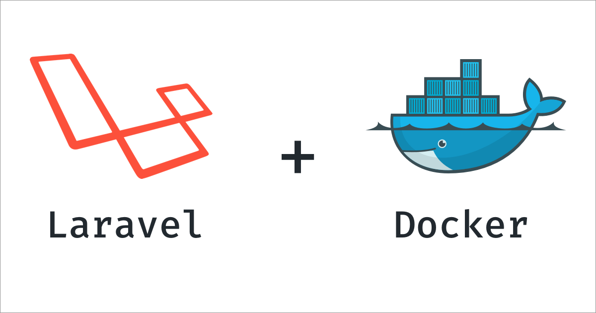
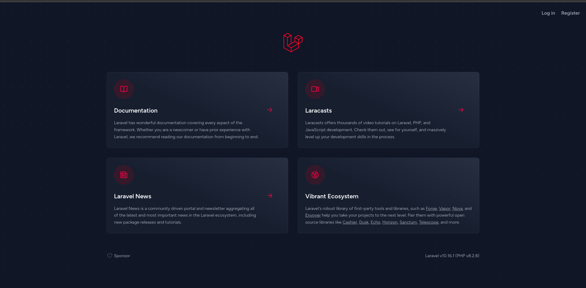
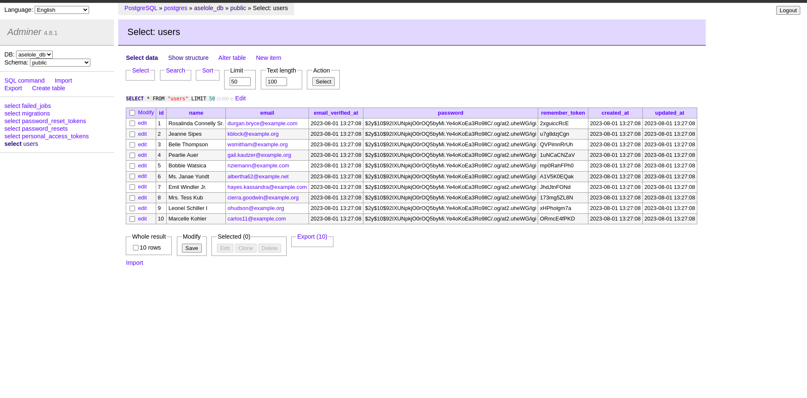
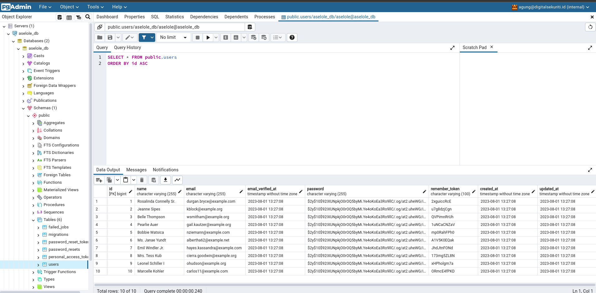

# Laravel with PostgreSQL (Dockerized)

<p align="center">
    
</p>

## Introduction

A lightweight and high-performance Laravel development environment using PHP 8.4-FPM (Alpine), PostgreSQL, and Nginx. This setup utilizes a multi-stage Docker build for a smaller, cleaner, and more efficient container image.


## Requirement

- Docker Engine
- Docker Compose


## Installation

1. Git clone & move to working directory
2. Settings your credentials, copy `.env.example` to `.env`
3. Execute the following command for create application

```bash
$ make create-project
```

4. Next, set environment DB for app laravel in  `src/.env` variable :
```
DB_CONNECTION=pgsql
DB_HOST=postgres
DB_PORT=5432
DB_DATABASE=<your_db_name>      // same in root .env variable POSTGRES_DB
DB_USERNAME=<your_db_user>      // same in root .env variable POSTGRES_USER
DB_PASSWORD=<your_db_password>  // same in root .env variable POSTGRES_PASSWORD
```

5. show application in [http://localhost:85](http://localhost:85)



1. show adminer in [http://localhost:8080](http://localhost:8080)



7. show pgadmin in [http://localhost:5050](http://localhost:5050)



8. list execute command in [Makefile](Makefile).

## Services & Ports
1. Laravel App: http://localhost:8000
2. Vite (HMR): http://localhost:5173
3. PostgreSQL: localhost:5432
4. Adminer: http://localhost:8080
5. PgAdmin: http://localhost:5050

## Container Architecture
1. App: PHP 8.4-FPM Alpine (Multi-stage build).
2. Web: Nginx Alpine.
3. DB: PostgreSQL 15.
4. Adminer/PgAdmin: Database management tools.

-------------

## Contributing
Contributions are welcome! Please follow these steps:

1. Fork this repository.
2. Create a new feature branch (`git checkout -b feature/amazing-feature`).
3. Commit your changes.
4. Push to the branch.
5. Open a Pull Request.

## Issues
If you encounter any bugs or have questions regarding the setup:

1. Please check the existing issues first.
2. If you don't find a solution, feel free to [open a new issue](https://github.com/agungprsty/laravel-postgres-with-docker/issues). Please include your docker-compose.yml configuration and the error logs to help us debug faster.
